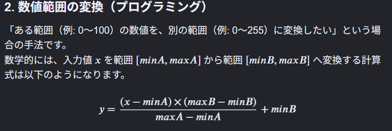

# Neural ODE 実験2025
## 今後やりたいこと
- 最初のノイズデータを保存する（この後の30回の実験の時に必要）✅
- 上で保存したノイズデータを使用して、NeuralODEを30回繰り返し、予測データの平均を取る✅
- とったデータのx,y各回それぞれの値の平均を取る✅
  
- 平均繰り返しを50回、100回で実行する（ReLU,tanh両方）
- reluとleaky relu の精度はどうか、違いがある場合はなぜその違いが出たのか

- 欠損値予測での3次元予測について、各グラフの座標の軸名を付ける（x,y,z）✅
- 欠損値予測で欠損値だけの誤差は計算できていないのでそこもやってみる✅
- 欠損値だけ色を変えて表示してみる✅
- 欠損値を固定して、真の値との誤差がどれくらいなのか分かるようにする✅
- z=x^2+y^2以外の関数で複雑な関数にも挑戦してみる。例えばz=sin(x)*cos(y)→z=sin(5x)*cos(5y)✅
- 二次元のsin関数の欠損値補間についても欠損値だけのmse誤差計算、予測結果と真の値との誤差計算やる✅
- 3次元画像の欠損値予測で予測結果を0~255の値を表示させて、ヒートマップのようなグレースケールの画像を出力してみる。変換公式は以下の通り✅

- 3次元画像の欠損値予測でも欠損値の補間箇所以外は観測データを使うようにする

- 現在128×128の解像度なので256×256にする。→その場合、欠損箇所は64×64の場合の座標で設定しているので256×256の場合の座標に置き換えていい感じに欠損箇所を設定する✅
- ある程度できたら、CNNとの精度比較をする。比較の際に使用するCNNはCNNと言ったらこれ！みたいな代表的なモデルにする。
- PSNR,SSIMなどの評価指標を導入し、他のアルゴリズムとの精度比較を行う✅
- 欠損画像補間について、現在は学習しかできていない状況。なので学習させたモデルをもとに別画像でテストする必要がある。学習させたモデルの保存、そのモデルを使った未知の欠損画像への適用を行う。
- cnnとneural odeを組み合わせたモデルが良いみたい。それとcnnだけのモデルとの比較をやってみる。→なんとかneural odeだけでできないもんかね
- 現在のコードでは一枚のpepper画像の座標に対して画素値を予測するのに特化したコードになっているから、ここから汎用性を高めるためモデルの入力に座標と特徴を加える必要があるらしい。その特徴を絞り出すためにCNNをつかう。学習では複数の画像を使って補間実験を行い、その学習したモデルで未知の画像の欠損を補間する
## 気づいたこと
- イテレーション1000,それを30回繰り返しの場合、ReLUの方が精度はよく見えるが一回が100分程度かかる。tanhは精度は悪く見えるが、毎回のばらつきは少なく、処理時間も30分程度と短い
- NeuralODEでの欠損値予測は座標をピンポイントに学習した上で、ではこの座標は？という風に予測している。なので、エッジやテクスチャといった画像ならではの特徴を学習するためにはCNNのような近傍学習(周囲の特徴を加味して学習)の方が向いている
- 3次元曲面補間においてx,y,zを256×256×256にすると学習箇所が増え、epoch数が200ではうまく予測できなかったため、epoch数10000にしてやってみたらいい感じになった。(2026/5/27)
- 一番最初の欠損画像補間では真の値と欠損値を含めたすべてにおいて補間をし、再構成をしていたため、予測結果がひどかった。なので、指定した欠損箇所以外の場所は真の値をそのまま表示することにした。そもそも、観測データで特徴を学習した上で欠損箇所を導補完できるかが実験の目的なので、欠損箇所以外の場所は真の値をそのまま使って問題ないと考えた。
- 欠損画像補間実験において、疑問点がある。
  - 「(20,20) 予測=0.3122 真値=0.0588 誤差=0.2534」のように値が結果として出ているがこれは何の値か調べる。色を示す値なら、0~255の値ではないのか。それか0~255の値が0~1の範囲の値に調整されているのかも→その通り。「img_array = img_array / 255.0」とあるように0～255の値を255で割っている。
- 10%のpsnrは18dbとかで良い結果ではない。理由はneural odeが一つ一つの座標と画素値の関係を学んでおり、CNNのように周囲の画素値の傾向を見て学習しているわけではないからではないかと考える。なので、平坦な部分では割とよく予測できているが、エッジや濃淡が頻繁に変化する部分ではうまく予測できていない
- ランダム欠損だと、周囲に正しい画素がたくさん残っているため、メディアンフィルタや平均化フィルタはかなり有利。